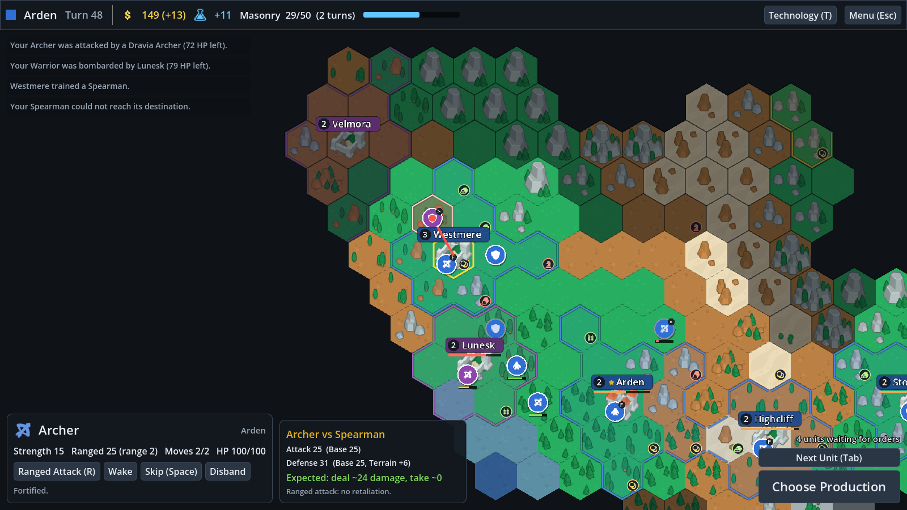

# Hexfare

A deliberately generic, Civilization-style hex strategy game for **Godot 4.7**: found cities,
grow them, research a small tech tree and fight AI opponents on a random hex map. It is meant
as a clean, tested framework to iterate on, not a finished game. Content and balance live in
JSON, the rules are plain GDScript with no scene dependencies, and a headless test suite plays
whole AI games to catch regressions.



## Quick start

1. Install Godot 4.7 (the standard build; .NET is not needed).
2. In the Godot project manager choose **Import**, select `project.godot` in this folder, then press **F5**.
   From a terminal: `godot --path <this folder>`.
3. On the title screen pick a map size, the number of AI opponents and (optionally) a seed.

First turn: select your settler and press **B** to found your capital, pick something to build,
pick a technology, then press **Enter** to end the turn. The big button in the bottom-right
corner always says what still needs a decision.

## Controls

| Input | Action |
|---|---|
| Left-click | Select a unit or city (click again to cycle through what's on the tile) |
| Right-click | Move the selected unit or attack; with your city selected, bombard a unit in range |
| WASD / arrow keys, middle-drag | Pan |
| Mouse wheel | Zoom |
| Tab or `.` | Next unit waiting for orders |
| Space | Skip the unit's turn |
| F | Fortify (military) / sleep (civilian) |
| B | Found a city (settler) |
| R | Ranged attack, then click a target |
| C | Center the camera on the selection |
| T | Technology tree |
| Enter | End turn |
| Esc | Close the tech tree / cancel targeting / deselect / pause menu |
| F5 / F9 | Quick save / quick load |
| G | Hex grid |
| F10 | Reveal the whole map (debug) |

Hovering an enemy with a unit selected shows the combat forecast: both strengths with a
breakdown of every modifier, and the expected damage each way.

## Rules at a glance

- **Map**: random continents in three sizes (32×20, 44×28, 56×36). Grassland (2 food), plains
  (1 food, 1 production), desert, tundra (1 food), coast (1 food, 1 gold), ocean (1 food). Hills
  and forest each add 1 production, +3 defense and an extra move cost. Mountains and water are
  impassable; there are no boats.
- **Resources**: bonus (wheat, stone), strategic (horses and iron, hidden until Animal
  Husbandry / Bronze Working and required for horsemen / swordsmen), luxury (gold, gems).
- **Cities**: founded by settlers at least 3 tiles apart; the first one gets the Palace. Each
  citizen eats 2 food and works a tile (picked automatically, food first); surplus food grows the
  city. Culture claims one new tile at a time. Cities build one thing at a time; anything on the
  build list can be bought outright for 3× its production cost in gold.
- **Economy**: five yields (food, production, gold, science, culture). Every city adds 1 science
  and 1 culture, plus 0.5 science and 0.5 gold per citizen (rounded down). Buildings cost gold upkeep, and so do
  units beyond 3 free plus 1 per city. Running out of gold disbands a unit.
- **Movement**: Civ V-style. A unit with any moves left may enter any passable tile, and go-to
  orders continue across turns. Each tile holds at most one military and one civilian unit.
- **Combat**: Civ VI-style. Damage = 30 × e^((attack − defense) / 25) × random(0.8–1.2) on a
  100 HP scale. Modifiers: terrain +3, fortified +4, −1 per 10 HP lost, unit bonuses (spearman vs.
  mounted, catapult vs. cities). Ranged attacks take no retaliation. Cities have 200 HP (+100 with
  walls), bombard units within 2 tiles once per turn, and fall to a melee unit that brings them to
  0 HP (ranged attacks stop at 1 HP). A melee unit that kills a defender advances and captures any
  civilian there.
- **Technology**: 14 techs in 5 tiers. Choosing a tech deep in the tree queues its prerequisites;
  extra science carries over.
- **Victory**: domination (last civilization standing), science (research every tech) or the
  best score at turn 300. A civilization with no cities and no settlers is eliminated. The tech
  tree is short: AI civilizations usually finish it, and win on science, around turn 80–100.

## Project layout

```
data/            Content and balance (JSON). Start here when iterating.
scenes/          main_menu.tscn and game.tscn (thin: the UI is built in code)
scripts/core/    Game state (map, tiles, units, cities, players) and Game, the action API
scripts/rules/   Stateless rules: yields, pathfinding, combat, cities, tech, visibility, map generation
scripts/ai/      Rule-based AI opponent
scripts/view/    Map rendering (layers, unit and city views, camera) and the game screen controller
scripts/ui/      HUD panels, theme, main menu
tests/           Headless test suites and a windowed UI smoke test
tools/           PowerShell helpers: run tests, take screenshots, import Kenney assets
assets/          Kenney CC0 art copied from the all-in-one pack
```

## Architecture

- **`GameState`** holds everything that is saved: map, players, units, cities, turn and the RNG.
  These are plain `RefCounted` objects with `to_dict()` / `from_dict()` for JSON saves.
- **`Game`** is the only code that changes the state. Every action is a method that validates,
  applies and emits signals: `move_unit`, `move_and_attack`, `attack`, `found_city`, `fortify`,
  `set_production`, `purchase`, `set_research`, `city_attack`, `end_turn`, and so on. Illegal
  actions return `false` and change nothing.
- **Rules modules** (`Yields`, `Pathfinder`, `Combat`, `CityRules`, `TechRules`, `Visibility`,
  `MapGenerator`) are static functions over the state. The UI calls the same functions for its
  previews (paths, combat odds, turns to build), so what the UI shows is what will happen.
- **`AIPlayer`** acts only through the `Game` API, so it obeys the same rules as the player. It
  does read the whole state, ignoring fog of war.
- **The view never mutates the game.** `MapView.sync()` reconciles the scene with the state after
  `Game.changed`; animations hang off `unit_moved` and `combat_resolved`. `GameScene` turns input
  into `Game` calls; HUD panels emit signals that `GameScene` handles.
- **Turn order**: the human (always player 0) acts, then `end_turn()` processes their cities,
  gold and science, runs every AI turn, and starts the next turn (healing, fresh moves, go-to
  orders continue).
- **Determinism**: all randomness goes through `state.rng`, which is saved with the game, so a
  seed plus the same actions replays identically. The simulation tests rely on this.

## Extending

Most additions are data-only. The build list, tech tree and AI pick up new entries
automatically, and `tests/test_data.gd` checks the cross-references and art paths.

**A unit** (`data/units.json`):

```json
"pikeman": {
	"name": "Pikeman", "class": "melee", "icon": "shield", "tech": "construction",
	"cost": 70, "strength": 32, "moves": 2, "sight": 2,
	"bonus_vs": {"mounted": 12}
}
```

`class` is `civilian`, `melee`, `ranged`, `mounted` or `siege`. `cost` is production. Give a unit
`ranged_strength` and `range` to make it ranged. Optional: `tech`, `requires_resource`,
`bonus_vs` (a unit class, or `city`), `abilities` (`["found_city"]`), `pop_cost`.

**A building** (`data/buildings.json`): `name`, `icon`, `tech`, `cost`, `upkeep`, and any of
`yields` (flat), `yield_percent` (percent of the city's total), `defense` (city strength) and `hp`
(city max HP). `"buildable": false` hides it from the build list, like the palace.

**A tech** (`data/techs.json`): `name`, `tier` (the tech-tree column), `cost` (science),
`requires`. Units and buildings point at techs through their `tech` field, and resources through
`reveal_tech`. `tile_bonuses` add yields to matching tiles, e.g. Mining:
`[{"elevation": "hills", "yields": {"production": 1}}]`. A bonus can match on `terrain`,
`elevation`, `feature` and/or `resource`.

**Terrain and resources** (`data/terrain.json`, `data/resources.json`): terrain `art` lists
Kenney tile names per look (`flat`, `forest`, `hills`, `hills_forest`, `mountains`), and a
`"tile+object"` entry draws an object from `assets/objects` on top of the tile. Resources list
the terrains and elevations they spawn on and a relative `weight`.

**Civilizations** (`data/civs.json`): a name, a color and a list of city names.

**Balance** (`data/rules.json`): map sizes and generation ratios, starting units, growth and
border curves, city defense, healing, unit upkeep, combat constants, the purchase multiplier and
which victories are enabled.

**Art**: icons are `assets/icons/<name>.png`. To pull more art from the Kenney pack, add the file
names to the manifest in `tools/import_kenney_assets.ps1` and run it. Water is the exception: it is
rendered in Blender by `E:\Blender\blender.exe -b --factory-startup --python art/tiles/build_water.py`
(~10 s) into `assets/terrain/water_<kind>_<n>.png`. `art/lib/tilekit.py` is the shared tile kit
(hex silhouette, top-down camera, flat shapes, PNG output), so another terrain is a short script
beside `build_water.py`. `-- --frames=N` renders an N-frame loop per tile as a strip plus a
`{"frames", "fps"}` json, for animating later; the game draws still tiles only for now.

**Code-level features** (a new unit ability, a new yield, a new victory type) follow the same
path: add the rule as a `Game` action or a rules-module function, expose it in the relevant HUD
panel, teach `AIPlayer` to use it, and add a test.

## Tests and tools

```powershell
.\tools\run_tests.ps1                 # all headless suites (~25 s, 10k+ checks)
.\tools\run_tests.ps1 -Only capture   # tests whose name contains "capture"
```

- `test_hex`, `test_data`, `test_rules` and `test_ai` are fast unit tests. `test_simulation`
  plays complete AI games on several seeds and checks invariants (no stacked units, units only
  on land, worked tiles inside their city's borders, and so on), determinism and speed. A full
  round of AI turns takes about 30 ms on a small map and 60 ms on a medium one.
- The UI smoke test boots the real game scene, drives it with injected mouse and keyboard events
  and checks the results (founding, production, research, movement, end turn, save, menus). It
  needs a window: `godot --path . res://tests/ui_smoke_test.tscn`.
- Screenshots for visual checks:
  `.\tools\screenshot.ps1 -Out shots\city.png -GameArgs "--seed=5","--autoplay=40","--select=city"`.
- 3D unit models (KayKit Mannequin rig + shared animation packs + weapon bits) are described by an
  optional `"model"` block in `data/units.json`: the pieces held in each hand and the clip for each
  role (idle, walk, attack, hit, death). A role can borrow an arm from another clip, e.g. walking
  with the shield arm in the guard pose. Weapons sit in hand slots that match how KayKit models
  them, so most need no rotation; see the comments in `scripts/view/unit_model.gd`.
  `res://scenes/unit_preview.tscn` cycles a unit through its roles. `-- --unit=warrior --sheet=out.png`
  saves a contact sheet (`--clips=walk,Melee_Block` picks rows, `--facing=90` turns the model) and
  `--right-rot=x,y,z` / `--left-rot=x,y,z` try a piece rotation without editing the data. Only the
  warrior has a model so far, and the map does not draw models yet.
- Sprite-sheet units (the 2D alternative) are built in Blender from scratch by a script:
  `E:\Blender\blender.exe -b --factory-startup --python art/warrior/build_warrior.py` (~1 min) models,
  rigs and animates the warrior, saves `art/warrior/warrior.blend` for hand tweaks, and renders
  idle/walk/attack/hit/death in six facings that point at the hex neighbours into
  `assets/units/warrior/` (sheet, team-colour mask, layout JSON). `-- --only=walk` / `--dirs=se`
  render just some animations or facings into a temp folder for a quick look; `--out=<dir>` writes
  the full sheets elsewhere. Unit scripts are short because the parts are shared, in `art/lib/`:
  `spritekit.py` (materials, meshes, rigs, posing, ropes, camera, rendering, sheets), `humanoid.py`
  (base body dressed from an outfit table, standing, breathing, walk cycle), `gear.py` (helmet,
  sword, shield, hat, cloak, staff...) and `quadruped.py` (a four-legged body sized from a proportions
  table, with a donkey preset, pack saddle and idle). `art/settler/build_settler.py` builds the settler, an adventurer
  leading a pack donkey (two actors in one rig, joined by a rope), with idle, walk and build (it
  hammers the ground with a mallet when founding a city; the city appears on the last blow, timed by
  the sheet's `"marks"`). Settlers never fight, so they have no attack, hit or death; a role a sheet
  lacks plays idle. Poses can show and hide parts (`sk.toggle`: the mallet moves from belt to hand). A sheet's JSON can size the stand drawn under
  the unit (`"base"`). `UnitSprite` (`scripts/view/unit_sprite.gd`) plays
  a sheet with the owner's colour; `res://scenes/sprite_preview.tscn` shows all six facings on hex
  tiles (`--unit=settler`, `--anim=walk`, `--zoom=2`, `--screenshot=out.png`). On the map, any unit with a sheet is drawn as
  a figure on a civ-coloured base (it walks, faces its moves, attacks, flinches and dies); the rest keep
  their tokens. Sheets are VRAM-compressed (BC7 colour, BC4 mask), which the build sets up.

The game scene accepts these flags after `--` (for example
`godot --path . res://scenes/game.tscn -- --seed=5 --autoplay=40`):

| Flag | Effect |
|---|---|
| `--seed=N`, `--size=small\|medium\|large`, `--players=N` | New-game settings |
| `--load` | Start from the quick save instead |
| `--autoplay=N` | The AI plays your civilization for N turns |
| `--reveal` | Reveal the map |
| `--select=city\|unit\|military` | Select your first city / first unit / unit nearest an enemy |
| `--tech`, `--zoom=Z` | Open the tech tree / set the camera zoom |
| `--hover=col,row`, `--hover-enemy`, `--hover-rel=dq,dr` | Hover a tile (shows tile info or the combat forecast) |
| `--screenshot=path.png`, `--delay=S` | Save a screenshot after S seconds (default 1) and quit |

## Not implemented (yet)

Intentionally left out to keep the base small: naval units and embarking, workers and tile
improvements, roads and rivers, happiness, diplomacy and trade, religion, great people, zone of
control, a multi-item build queue, choosing your civilization, and multiplayer. The AI sees
through fog of war.

## Roadmap and contributing

Planned work is tracked in the [milestones](https://github.com/Skigim/Hexfare/milestones) and
[issues](https://github.com/Skigim/Hexfare/issues). See [CONTRIBUTING.md](CONTRIBUTING.md) for the
workflow and labels.

## License

The code and Blender scripts are [MIT](LICENSE). The bundled third-party art is CC0 (below).

## Credits

Art and fonts by [Kenney](https://kenney.nl), CC0 (see `assets/LICENSE-kenney.txt`). Character
animations and weapon pieces by [Kay Lousberg (KayKit)](https://www.kaylousberg.com), CC0 (the
`License.txt` files in `assets/KayKit_*`). Built with [Godot Engine](https://godotengine.org).
